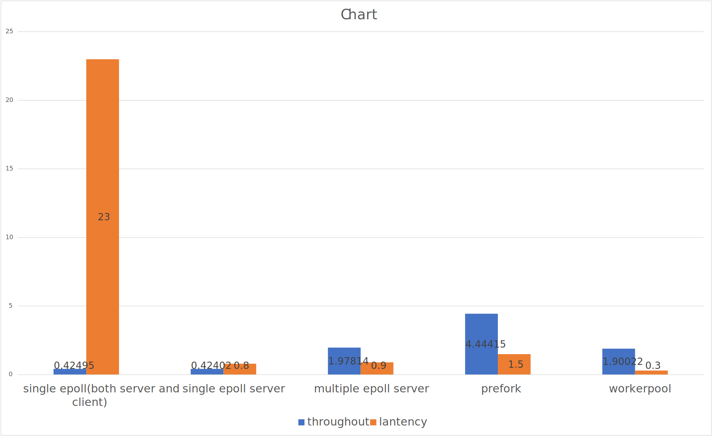

> what update:
>
> - 对源代码做了不少的详细注释，希望能为初学者提供更好的阅读体验
> - 添加了 chart of throughputs

# Benchmark for implementation of servers that support 1m connections

inspired by [handling 1M websockets connections in Go ](https://github.com/eranyanay/1m-go-websockets)

## Servers

1. **1_simple_tcp_server**： a 1m-connections server implemented based on `goroutines per connection`
2. **2_epoll_server**: a 1m-connections server implemented based on `epoll`
3. **3_epoll_server_throughputs**: 	add throughputs and latency test for 2_epoll_server
4. **4_epoll_client**: 	implement the client based on `epoll`
5. **5_multiple_client**: 	use `multiple epoll` to manage connections in client
6. **6_multiple_server**:  	use `multiple epoll` to manage connections in server
7. **7_server_prefork**: 	use `prefork` style of apache to implement server
8. **8_server_workerpool**: use `Reactor` pattern to implement multiple event loops
9. **9_few_clients_high_throughputs**: a simple `goroutines per connection` server for test throughtputs and latency
10. **10_io_intensive_epoll_server**: an io-bound `multiple epoll`  server
11. **11_io_intensive_goroutine**:  an io-bound `goroutines per connection` server
12. **12_cpu_intensive_epoll_server**: a cpu-bound `multiple epoll`  server
13. **13_cpu_intensive_goroutine**:  an cpu-bound `goroutines per connection` server
	
## Test Environment

- two `E5-2630 V4` cpus, total **20** cores, **40** logicial cores.
- 32G memory 

tune the linux:

```sh
sysctl -w fs.file-max=2000500
sysctl -w fs.nr_open=2000500
sysctl -w net.nf_conntrack_max=2000500
ulimit -n 2000500

sysctl -w net.ipv4.tcp_tw_recycle=1
sysctl -w net.ipv4.tcp_tw_reuse=1
```

client sends the next request only when it has received the response. it has not used the `pipeline` style to test.
## Benchmarks

### 1m connections

| | throughputs (tps) | latency |
|--|--|--|
|goroutine-per-conn|202830|4.9s|
|single epoll(both server and client)| 42495 | 23s|
|single epoll server| 42402 | 0.8s|
|multiple epoll server| 197814 | 0.9s|
|prefork| 444415 | 1.5s|
|workerpool| 190022 | 0.3s|

实际上，由于 goroutine-per-conn 在 server 的 response 手段上使用了 mock io 的方式，与其他模型是不一样的。

单位：throughputs(100,000 tps), latency(s)



可以见得，最后三个的性能最好，其中：

- multiple epoll sever 是一个折中的选择
- prefork 相对吞吐量最大，但是延迟也较大 
- workpool 吞吐量比 multiple epoll sever 略小（差），但是延迟也较小（好）

**中文介绍**:

1. [百万 Go TCP 连接的思考: epoll方式减少资源占用](https://colobu.com/2019/02/23/1m-go-tcp-connection/)
2. [百万 Go TCP 连接的思考2: 百万连接的服务器的性能](https://colobu.com/2019/02/27/1m-go-tcp-connection-2/)
3. [百万 Go TCP 连接的思考3: 低连接场景下的服务器的吞吐和延迟](https://colobu.com/2019/02/28/1m-go-tcp-connection-3/)
